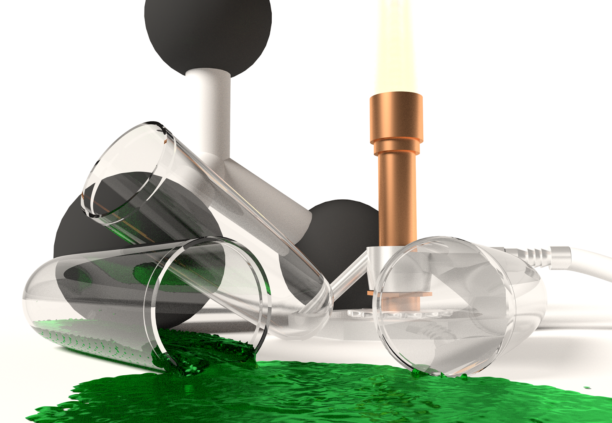
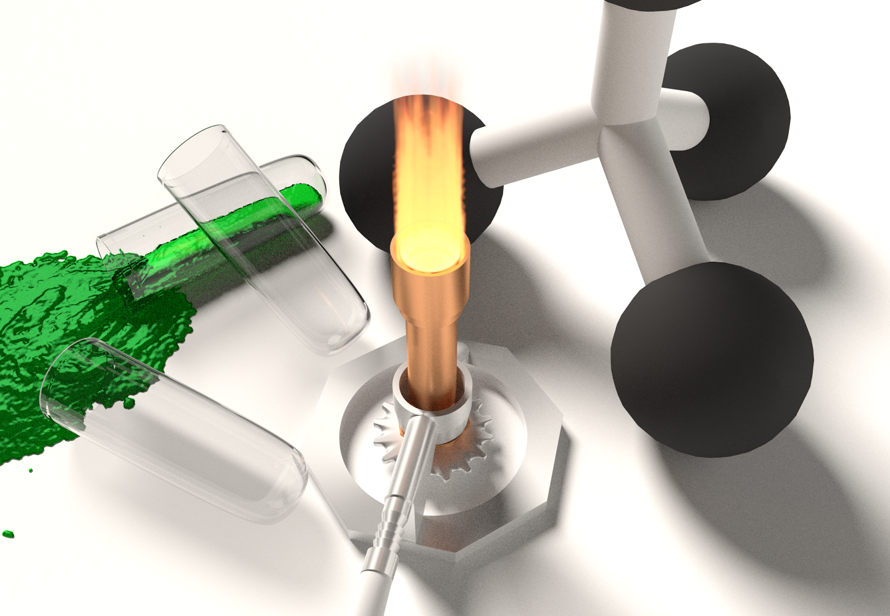

# Bunsen Burner Model

(This is old, from Friday, January 6, 2017)

Last semester I was part of a research team with proper scientists, with test tubes and Bunsen burners and such. I love modelling with a physical object to copy, because you end up noticing so many physical details that are easily forgotten if you have to work to remember them. This project's most annoying detail was the glass: it just never came out right. I eventually [looked up the refractive index of Borosilicate Crown glass](http://refractiveindex.info/?shelf=glass&book=HIKARI-BK&page=J-BK7A), which is used in labware. Turns out Blender's caustics algorithms are accurate, I think the reflections in the test tubes came out well.

[Link to my blender files](TestTubeArt.tar.gz).

The flame atop the Bunsen Burner isn't really visible with the white background, let's fix that:

