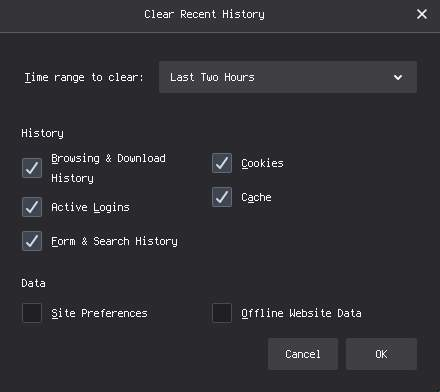

# Firefox Cleanup Script

Web browsers store information. A LOT of information.

99% of it is useless; I routinely spell-check by googling words like `epilogue` and `antidisestablishmentarianism`
which do not need to appear in my browser history.
They clutter the stuff I care about, like [this stupid cable](https://www.amazon.com/gp/product/B01LW50R03/)
which I was looking at and forgot about, then realized it would make powering CPU fans a breeze and wanted to order it.

Firefox's hisory clearing works from **now -> last week**, which is completely useless
because it would remove my recent browsing history that I actually use:

I needed something to clear my history from **last week -> January 1 1970**, which led me to
[research how FF stores history data](https://www.foxtonforensics.com/browser-history-examiner/firefox-history-location),
and because sqlite is simple and awesome I threw a python script together to nuke old stuff:

[clean_ff.py](clean_ff.py)

#!/usr/bin/env python

import os, sys, subprocess
import sqlite3
from datetime import date, timedelta
import time

# Replace with your user profile, see about:profiles in the browser
PROFILE='/j/.mozilla/firefox/cfzbb6kw.default-release/'

if __name__ == '__main__':
  db = f"{PROFILE}/places.sqlite"
  conn = sqlite3.connect(db);

  today = date.today()
  last_week = today - timedelta(days=7)
  # firefox stores times in epoch nanoseconds (epoch seconds * 1 million)
  oldest_nanoseconds = int( time.mktime(last_week.timetuple()) ) * 1000000
  print(f"oldest_nanoseconds={oldest_nanoseconds}");

  # Remove all from moz_bookmarks_deleted
  r = conn.execute("""
delete from moz_bookmarks_deleted where 1=1;
""")
  print(f"moz_bookmarks_deleted r.rowcount={r.rowcount}")

  # Trim moz_historyvisits
  r = conn.execute(f"""
delete from moz_historyvisits where visit_date < {oldest_nanoseconds};
""")
  print(f"moz_historyvisits r.rowcount={r.rowcount}")

  # Trim moz_inputhistory
  r = conn.execute("""
delete from moz_inputhistory where use_count < 4;
""")
  print(f"moz_inputhistory r.rowcount={r.rowcount}")

  
  conn.commit()
  conn.close()

  db = f"{PROFILE}/cookies.sqlite"
  conn = sqlite3.connect(db);

  # Remove cookies > 1 month old
  r = conn.execute(f"""
delete from moz_cookies where creationTime < {oldest_nanoseconds};
""")
  print(f"moz_cookies r.rowcount={r.rowcount}")

  conn.commit()
  conn.close()

